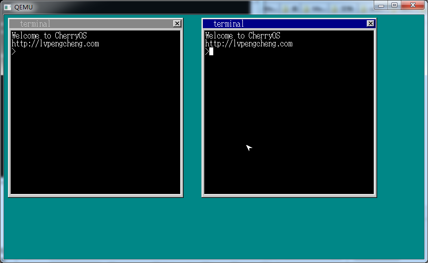
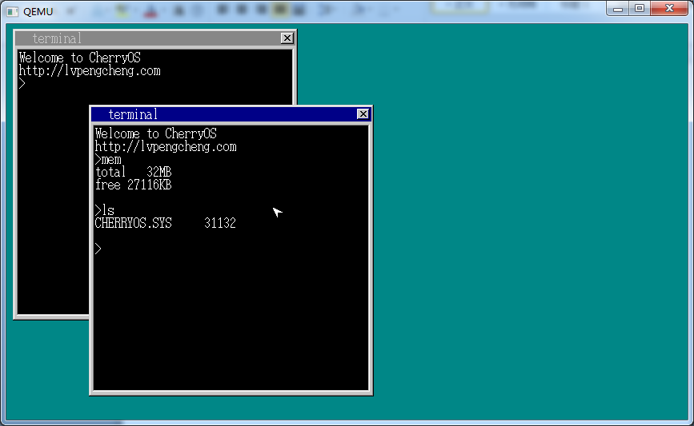

Cherry OS
===========

A simple OS like linux, just for fun.

version 1.0 is a simple OS which contain simple memory/task/UI/device/fs management.

version 2.0 has been completed immediately...
version 2.0 has much more advanced than v1.0. the kernel is a simple imitation of linux kernel 2.6.27

Demo
-----------------------------------

